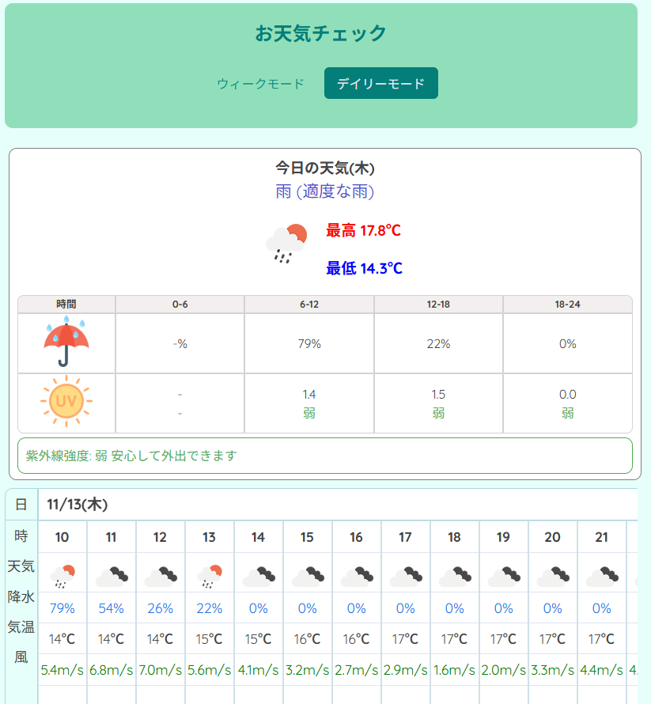
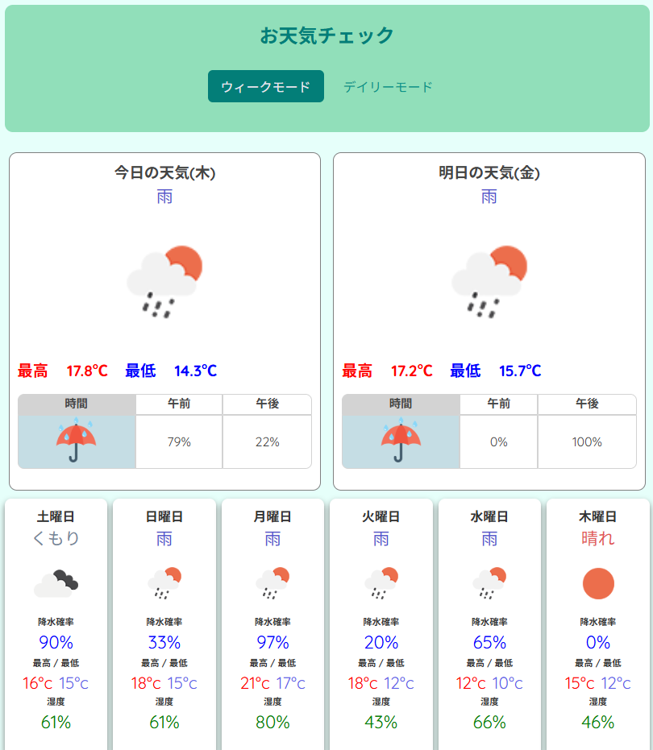
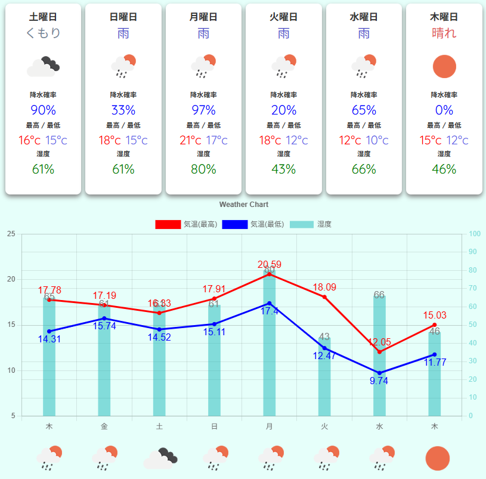

# お天気予報アプリ

## 概要

現在地の天気情報を取得し、週間天気予報や時間ごとの詳細な天気情報を表示する React アプリケーションです。

## 主な機能

- 現在地の自動取得
- 今日・明日の詳細天気情報
- 週間天気予報(最大 8 日間)
- 時間ごとの天気・降水確率・気温・風速表示
- 降水確率アラート機能
- 紫外線指数の表示とアドバイス
- ウィークモード/デイリーモード切り替え
- 天気予報に関する知識コンテンツ

## 技術スタック

- **フロントエンド**: React 19.1.0
- **ビルドツール**: Vite 6.3.2
- **グラフライブラリ**: Chart.js 4.4.9, react-chartjs-2 5.3.0
- **アイコン**: react-icons 5.5.0
- **API**: OpenWeatherMap API (One Call API 3.0)

## スクリーンショット

### デイリーモード

今日の詳細な天気情報を時間ごとに表示します。



### ウィークモード

今日・明日のカード表示と週間天気予報を確認できます。



### 天気グラフ

気温の推移と湿度をグラフで視覚的に表示します。



## 使い方

### モード切り替え

- **ウィークモード**: 今日・明日のカード表示と週間天気予報
- **デイリーモード**: 今日の詳細な時間ごと天気情報

### 表示情報

- **天気状況**: 晴れ/雨/曇り/雪
- **気温**: 最高気温・最低気温（グラフは季節に応じて自動調整）
- **降水確率**: 時間帯ごとの降水確率
- **紫外線指数**: 5 段階評価と対策アドバイス
- **湿度**: パーセント表示
- **風速**: m/s 単位

### アラート機能

- 降水確率が 50%以上の時間帯がある場合、アラート表示
- 紫外線強度に応じた対策アドバイスの表示

## 前提条件

- Node.js (推奨: v18.0.0 以上)
- npm (推奨: v8.0.0 以上)
- OpenWeatherMap API キー
- ブラウザの位置情報取得機能の許可

## セットアップ方法

### 1. リポジトリのクローン

```bash
git clone <このリポジトリのURL>
cd <プロジェクトディレクトリ>
```

### 2. 必要なパッケージのインストール

プロジェクトのルートディレクトリで以下のコマンドを実行し、必要な依存関係をインストールします。

```bash
npm install
```

### 3. OpenWeatherMap API キーの取得

このアプリを使用するには、OpenWeatherMap API キーが必要です。以下の手順で取得してください。

#### 3-1. アカウント登録

1. [OpenWeatherMap](https://openweathermap.org/)にアクセス
2. 右上の「Sign In」→「Create an Account」をクリック
3. 必要事項を入力してアカウントを作成
4. 登録したメールアドレスに確認メールが届くので、リンクをクリックして認証

#### 3-2. API キーの取得

1. ログイン後、右上のユーザー名をクリック
2. 「My API keys」を選択
3. デフォルトの API キーが既に生成されているか、「Create Key」で新しいキーを作成
4. 生成された API キー（長い英数字の文字列）をコピー

**注意**:

- API キーが有効になるまで数分から数時間かかる場合があります

#### 3-3. API キーの動作確認（オプション）

以下の URL で API キーが正しく動作するか確認できます（ブラウザで開く）：

```
https://api.openweathermap.org/data/3.0/onecall?lat=35.6762&lon=139.6503&appid=YOUR_API_KEY
```

※ `YOUR_API_KEY` を実際の API キーに置き換えてください

正常に動作している場合、JSON 形式の天気データが返されます。

### 4. 環境変数の設定

#### 4-1. .env ファイルの作成

プロジェクトのルートディレクトリ（`package.json`があるフォルダ）に `.env` という名前のファイルを作成してください。

#### 4-2. API キーの記述

作成した `.env` ファイルをテキストエディタで開き、以下のように記述します：

```
VITE_WEATHER_API_KEY=ここにコピーしたAPIキーを貼り付け
```

**記述例**:

```
VITE_WEATHER_API_KEY=a1b2c3d4e5f6g7h8i9j0k1l2m3n4o5p6
```

**重要な注意点**:

- `=` の前後にスペースを入れない
- API キーを `""` や `''` で囲まない
- `.env` ファイルは `.gitignore` に含まれているため、Git リポジトリにはアップロードされません
- **API キーは絶対に公開しないでください**

### 5. 開発サーバーの起動

以下のコマンドを実行すると、Vite の開発サーバーが起動します。

```bash
npm run dev
```

サーバーが起動したら、ターミナルに表示されたローカルホストのアドレス（例: `http://localhost:5173`）にブラウザでアクセスしてください。

### 6. 位置情報の許可

初回アクセス時、ブラウザが位置情報の使用許可を求めます。「許可」をクリックしてください。位置情報を許可しないと、天気情報を取得できません。

### 7. (オプション) 本番用のビルド

プロジェクトを本番環境用にビルドする場合は、以下のコマンドを実行します。

```bash
npm run build
```

`dist` フォルダ内に、最適化された本番用ファイルが生成されます。

ビルドしたアプリをプレビューする場合：

```bash
npm run preview
```

## プロジェクト構成

```
src/
├── components/
│   ├── Header/          # ヘッダーコンポーネント
│   ├── Examples.jsx     # 天気知識コンテンツ
│   ├── WeatherChecker.jsx  # メインの天気取得ロジック
│   ├── WeatherCards.jsx    # 週間天気カード表示
│   ├── WeatherChart.jsx    # 天気グラフ表示
│   ├── TodayTommorrow.jsx  # 今日・明日の詳細表示
│   └── WeatherHeader.jsx   # 天気セクションヘッダー
├── data.jsx             # 静的データ・コンテンツ
├── App.jsx              # メインアプリ
└── index.jsx            # エントリーポイント
```

## トラブルシューティング

### 「データ取得エラー」が表示される

**原因と対処法**:

1. **API キーが無効**

   - `.env` ファイルが正しい場所にあるか確認
   - API キーに余計なスペースや引用符がないか確認
   - OpenWeatherMap で新しく API キーを作成した場合、有効になるまで数時間待つ

2. **環境変数の読み込みエラー**

   - 開発サーバーを再起動（`.env` ファイル作成後は必須）
   - Ctrl+C でサーバーを停止後、`npm run dev` で再起動

3. **API レート制限超過**
   - 無料プランでは 1 分間 60 回、1 日 1,000 回の制限があります
   - 時間を置いてから再度アクセスしてください

### 位置情報が取得できない

- ブラウザの位置情報許可設定を確認してください
- HTTPS で接続されていることを確認してください（位置情報 API は HTTPS 必須）
- プライベートモード/シークレットモードでは位置情報が制限される場合があります

### 天気情報が表示されない

- ブラウザのコンソール（F12 キー）を開いてエラーメッセージを確認してください
- ネットワークタブで API リクエストが失敗していないか確認してください

### 「Loading...」から進まない

- インターネット接続を確認してください
- ブラウザのキャッシュをクリアしてみてください
- 位置情報の取得に時間がかかる場合があります（最大 30 秒程度）

## 開発者向け情報

### 利用可能なスクリプト

```bash
# 開発サーバー起動
npm run dev

# 本番ビルド
npm run build

# ビルドしたアプリのプレビュー
npm run preview
```

### コード構成のポイント

- 天気データ取得は `WeatherChecker.jsx` で管理
- 状態管理は主にローカル state 使用
- API キーは環境変数で管理（`.env`ファイル）
- Chart.js を使用した気温グラフは季節に応じて自動的に Y 軸範囲を調整

### 環境変数について

- Vite では環境変数に `VITE_` プレフィックスが必要です
- クライアントサイドで使用する環境変数のみ `VITE_` で始める必要があります
- `.env` ファイルの変更後は必ず開発サーバーを再起動してください

## 今後の改善予定

- [ ] 複数地点のお気に入り登録機能
- [ ] 通知機能（降雨アラートなど）
- [ ] 地域名の表示

## ライセンス

このプロジェクトは MIT ライセンスの下で公開されています。

## 謝辞

- 天気データ提供: [OpenWeatherMap](https://openweathermap.org/)
- アイコン: [react-icons](https://react-icons.github.io/react-icons/)
- グラフライブラリ: [Chart.js](https://www.chartjs.org/)

## 参考リンク

- [OpenWeatherMap API ドキュメント](https://openweathermap.org/api/one-call-3)
- [Vite ドキュメント](https://vitejs.dev/)
- [React ドキュメント](https://react.dev/)
